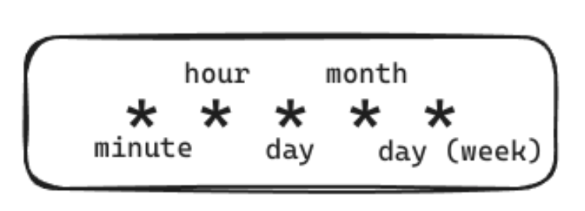

    

# Overview

This is the CRON scheduling component for Paddy, the Power Administration Daemon.

It uses [Quarkus, the Supersonic Subatomic Java Framework](https://quarkus.io/) running Java 17, is written in Kotlin, and is deployed in Docker.

The scheduling component of this project aims to do something that can be very easily verbalized: Manage the Daemon’s schedules by turning them on and off at a specified time. While this is an issue that can be quite easily explained, the implementation is not trivial.

# Description

1. **Why This Is A Standalone Microservice:** Originally, the scheduling component of this project was designed as part of the Backend Business Logic service, which is described in the previous subsection. In fact, a part of the logic was written in it originally, only for a challenge to make it impossible to continue. As mentioned above, the backend service needs to serve many devices, and as such has to remain horizontally scalable, which is great for idempotent tasks, but not so much so for other types. The problem showed up when the delegation of scheduling tasks came up for discussion. Assuming we have N replicas of this scheduling service, which one is supposed to execute which tasks? Every service executing it would not be an option, as that would litter the broker with unnecessary MQTT messages and possibly create bugs in the Toggle scenario, which is not idempotent. As such, the logic was refactored to an independent service which runs in a standalone way, without any horizontal scalability. This is not to say that this type of implementation is impossible however, and an elegant solution exists. However, many corner cases are to be taken into account.

2. **Task Types:** The scheduling microservice handles two main types of tasks: Single and Periodic. As the names imply, Single tasks run only once and Periodic ones run repeatedly on a specified schedule. Single tasks have a simple implementation; by using a UNIX timestamp to represent the desired time of running a task, it can be scheduled to run when necessary. Meanwhile, periodic tasks needed a more complex system to allow the user to specify scheduling on a given period of time. The most elegant solution was the implementation of Cron jobs, a type of job scheduling syntax which was developed by AT&T Bell Laboratories in 1975.
While many extensions and similar formats have been created today, classic Cron jobs are formatted as space-delimited strings, with five distinct positions for temporal values.

    

> While usually numbers are used to describe each temporal unit, asterisks can be used to mean “every”. In addition, operators such as commas, dashes and slashes can be used to specify a wider type of values with a simpler syntax, such as a value list, value range, or step values.

3. **Task Handling Logic:** While an event-driven mechanism would be the best solution, it can be complex to create something fully so. As such, the approach for managing many tasks was done through rationed use of resources and optimization in the form of a Schedule Pool. This pool uses a Hash Set as an underlying data structure, as every element (schedule) in said pool is unique and therefore can benefit from the lack of inherent order. When the application starts up, this pool is filled with all available scheduling tasks in the database. Next, after the pool has been instantiated, the application polls this pool every five seconds by checking if any task in the pool is ready to be executed. This is done by simply checking if the next execution timestamp of a scheduled task is smaller than the current timestamp. If true, the task is executed by sending the according message to the target Daemon through the EMQX broker.

However, there is another problem to tackle here: since the API for schedule management is exposed on the Backend microservice, the Schedule service has no direct way of understanding whether a new task was created without polling the database, too. Since database polling would be an expensive operation, the MQTT broker cluster was used instead. As such, when the Backend receives any CRUD operation regarding task scheduling, it not only updates the database with the result of this task, but also publishes the operation to a special internal topic in the MQTT broker. On the other end, the Schedule service listens to events on this topic and handles them appropriately by creating/deleting tasks in the schedule pool.